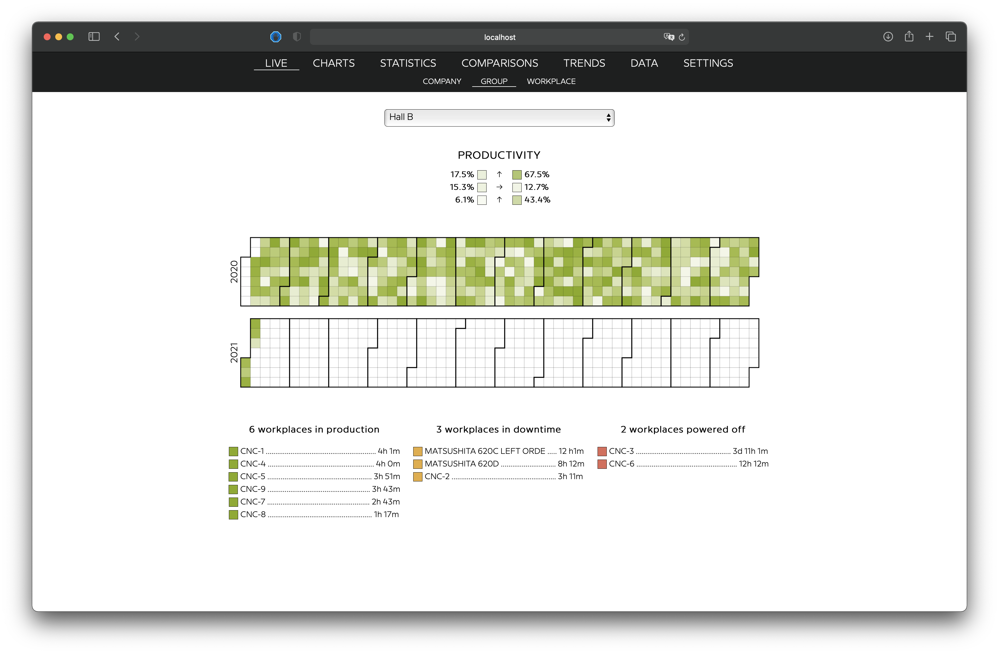

[](https://www.jetbrains.com/go/)
<br/>
 
[](https://github.com/petrjahoda/system_webservice_beta/commits/master)
[](https://github.com/petrjahoda/system_webservice_beta/issues)
<br/>


<br/>
[](https://hub.docker.com/r/petrjahoda/system_webservice_beta)
[](https://hub.docker.com/r/petrjahoda/system_webservice_beta/tags)
<br/>
[](https://www.postgresql.org) [](https://www.docker.com)

# System WebService Beta

## Description
Go web service for user UI

## Installation Information
Install under docker runtime using [this dockerfile image](https://github.com/petrjahoda/system/tree/master/latest) with this command: ```docker-compose up -d```

## Implementation Information
Check the software running with this command: ```docker stats```. <br/>
System_service has to be running. No need to make a specific setup.

## Developer Information
Use software only as a [part of a system](https://github.com/petrjahoda/system) using Docker runtime.<br/>
 Do not run under linux, windows or mac on its own.
 
 ## Roadmap
 - [x] Project structure
 - [x] Service
 - [x] Main menu
 - [x] Dynamically loaded submenu
 - [x] User login
 - [x] Locale based user interface
 - [x] Dynamically load menu content
 - [ ] Dynamically load proper javascript
 - [ ] All menus UI and UX structure
 - [ ] Live menu
    - [ ] Factory submenu
    - [ ] Group submenu
    - [ ] Workplace submenu
 - [ ] Charts menu
    - [ ] Standard Charts submenu
    - [ ] Special Charts submenu
 - [ ] Statistics menu
    - [ ] Factory submenu
    - [ ] Group submenu
    - [ ] Workplace submenu
    - [ ] User submenu
    - [ ] Downtime submenu
    - [ ] Breakdown submenu
    - [ ] Alarm submenu
 - [ ] Comparisons menu
     - [ ] Factory submenu
     - [ ] Group submenu
     - [ ] Workplace submenu
     - [ ] User submenu
     - [ ] Downtime submenu
     - [ ] Breakdown submenu
     - [ ] Alarm submenu
 - [ ] Trends menu
     - [ ] Factory submenu
     - [ ] Group submenu
     - [ ] Workplace submenu
     - [ ] User submenu
     - [ ] Downtime submenu
     - [ ] Breakdown submenu
     - [ ] Alarm submenu
     - [ ] Top 10
     - [ ] Bottom 10
 - [ ] Data menu
     - [ ] Factory submenu
     - [ ] Group submenu
     - [ ] Workplace submenu
     - [ ] User submenu
     - [ ] Downtime submenu
     - [ ] Breakdown submenu
     - [ ] Alarm submenu
     - [ ] Order submenu
     - [ ] Product submenu
 - [ ] Settings menu
     - [ ] Factory submenu
     - [ ] Group submenu
     - [ ] Workplace submenu
     - [ ] User submenu
     - [ ] Downtime submenu
     - [ ] Breakdown submenu
     - [ ] Alarm submenu      
     - [ ] Device submenu      

 
>

© 2020 Petr Jahoda